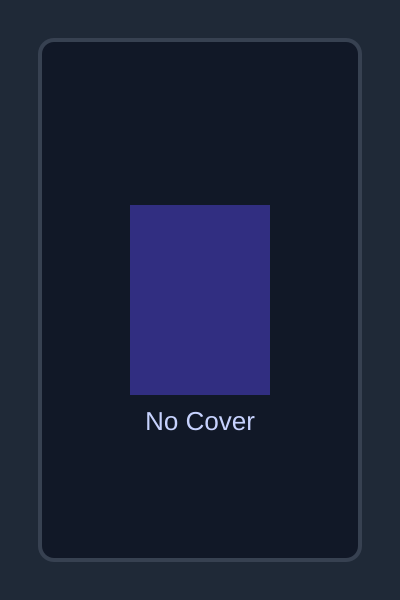

# Book Intelligence Platform

Full-stack Document Intelligence Platform for books using Django REST Framework, Next.js + Tailwind CSS, Selenium scraping, ChromaDB retrieval, and LM Studio local LLM integration.

## Screenshots

These UI screenshots are included in `docs/screenshots/`:

- Dashboard:
  
- Book Detail:
  
- Q&A Interface:
  

## Project Structure

```text
book-intelligence/
├── backend/          # Django REST Framework backend
├── frontend/         # Next.js + Tailwind frontend
├── scraper/          # Selenium scraper
├── samples/          # API/test sample payloads and examples
└── requirements.txt  # Root Python dependencies
```

## Setup Instructions

### 1) Clone and Environment

```bash
git clone <your-repo-url>
cd book-intelligence
python3 -m venv .venv
source .venv/bin/activate
python3 -m pip install --upgrade pip
```

### 2) Install Dependencies

```bash
pip install -r requirements.txt
```

### 3) Configure Environment

Create a `.env` in `backend/` using `.env.example`:

```bash
cp .env.example backend/.env
```

Default local run mode uses SQLite fallback (`USE_SQLITE=True`).  
To use MySQL (`bookdb`) set `USE_SQLITE=False` and configure `MYSQL_*` values.

### 4) Run Backend

```bash
cd backend
python3 manage.py migrate
python3 manage.py runserver 0.0.0.0:8000
```

### 5) Run Frontend

In another terminal:

```bash
cd frontend
npm install
npm run dev
```

Frontend: `http://localhost:3000`  
Backend API: `http://localhost:8000`

### 6) Optional: Run Scraper

In another terminal:

```bash
python3 scraper/scrape.py
```

This scrapes at least 5 pages from `https://books.toscrape.com`, posts books to `/api/books/upload/`, and stores backup data at `scraper/books_raw.json`.

## API Documentation

Base URL: `http://localhost:8000/api`

### `GET /books/`
Returns list of books:

```json
[
  {
    "id": 1,
    "title": "Book A",
    "author": "Unknown",
    "rating": 4.0,
    "cover_image_url": "https://...",
    "genre": "mystery"
  }
]
```

### `GET /books/<id>/`
Returns full book details including `description`, `summary`, and metadata.

### `GET /books/<id>/recommendations/`
Returns top 3 similar books using ChromaDB vector similarity.

### `POST /books/upload/`
Accepts either:

```json
{ "book_url": "https://books.toscrape.com/catalogue/..." }
```

or full payload:

```json
{
  "title": "Example Book",
  "author": "Unknown",
  "rating": 4,
  "description": "Book description",
  "cover_image_url": "https://books.toscrape.com/media/cache/...",
  "book_url": "https://books.toscrape.com/catalogue/..."
}
```

### `POST /books/ask/`

Request:

```json
{
  "question": "What is this book mainly about?",
  "book_id": 1
}
```

Response:

```json
{
  "answer": "The book focuses on ...",
  "sources": ["Book Title 1", "Book Title 2"]
}
```

## Sample Questions and Answers

See `samples/sample_qa.md` for expanded examples. Quick examples:

- **Q:** What are the key themes in this book?
  **A:** Themes include identity, resilience, and social pressure.
- **Q:** Recommend similar books to this one.
  **A:** Based on semantic similarity, try titles with overlapping themes and tone.
- **Q:** Summarize this book in 3 points.
  **A:** Core conflict, major character arc, and ending implications.

## Requirements

Python dependencies are in:

- `requirements.txt` (root)
- `backend/requirements.txt` (backend specific)

Node dependencies are in:

- `frontend/package.json`

## Samples for Testing

Use sample files in `samples/`:

- `samples/upload_book.json` for `/api/books/upload/`
- `samples/ask_question.json` for `/api/books/ask/`
- `samples/sample_qa.md` for expected-style Q&A examples

Example test calls:

```bash
curl -X POST http://localhost:8000/api/books/upload/ \
  -H "Content-Type: application/json" \
  -d @samples/upload_book.json
```

```bash
curl -X POST http://localhost:8000/api/books/ask/ \
  -H "Content-Type: application/json" \
  -d @samples/ask_question.json
```
