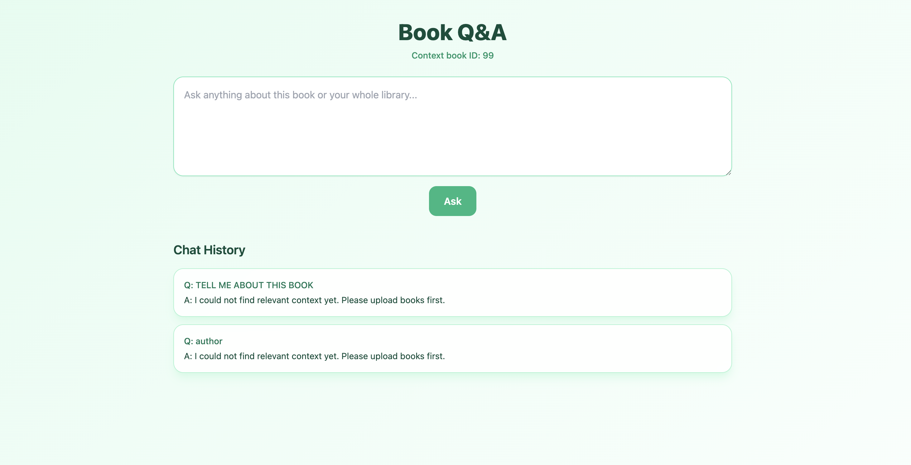
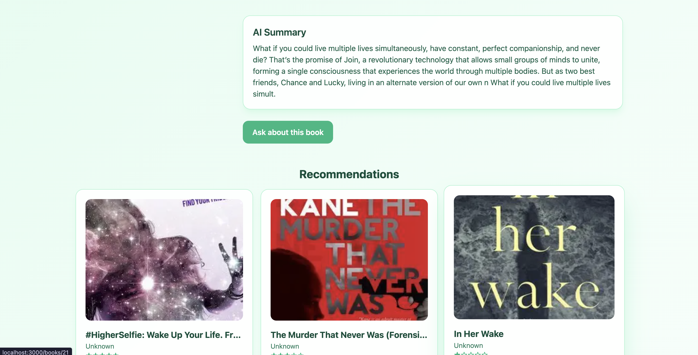
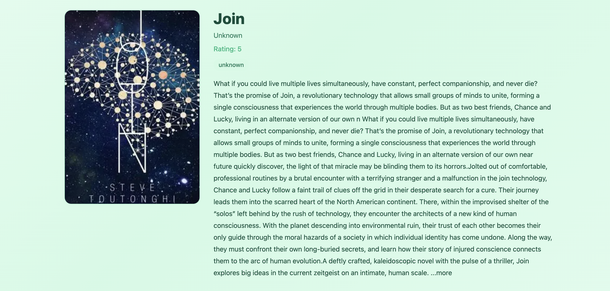

# Book Intelligence Platform

A full-stack Document Intelligence Platform for books that combines web scraping, AI-generated insights, semantic retrieval, and conversational Q&A.

## Features

- Django REST backend for ingestion, retrieval, recommendations, and Q&A
- Next.js frontend with Dashboard, Book Detail, and Q&A flows
- Selenium scraper for `books.toscrape.com` (multi-page crawl)
- AI insights generation (summary + genre classification)
- RAG pipeline using sentence-transformers + ChromaDB
- Local LLM integration via LM Studio (`http://localhost:1234/v1/chat/completions`)

## Screenshots

- Personal Screenshot 1  
  
- Personal Screenshot 2  
  
- Personal Screenshot 3  
  

## Project Structure

```text
book-intelligence/
├── backend/               # Django REST Framework app
│   ├── backend/           # settings/urls/asgi/wsgi
│   └── books/             # models, APIs, AI modules, RAG
├── frontend/              # Next.js + Tailwind UI
├── scraper/               # Selenium + BeautifulSoup scraper
├── samples/               # sample payloads and QA examples
├── docs/screenshots/      # README images
└── requirements.txt       # root python dependencies
```

## Tech Stack

- **Backend:** Django, Django REST Framework, ChromaDB, sentence-transformers, PyMySQL
- **Frontend:** Next.js (App Router), React, Tailwind CSS
- **Scraping:** Selenium, BeautifulSoup
- **LLM:** LM Studio (OpenAI-compatible local endpoint)
- **Database:** SQLite (default local fallback) / MySQL (optional via env)

## Setup Instructions

### 1) Clone and Prepare Environment

```bash
git clone <your-repo-url>
cd book-intelligence
python3 -m venv .venv
source .venv/bin/activate
python3 -m pip install --upgrade pip
```

### 2) Install Python Dependencies

```bash
pip install -r requirements.txt
```

### 3) Configure Environment Variables

```bash
cp .env.example backend/.env
```

Default mode uses SQLite (`USE_SQLITE=True`) for quick local startup.  
For MySQL (`bookdb`), set `USE_SQLITE=False` and configure `MYSQL_*` env values.

### 4) Run Backend

```bash
cd backend
python3 manage.py migrate
python3 manage.py runserver 0.0.0.0:8000
```

Backend API: `http://localhost:8000`

### 5) Run Frontend

In a new terminal:

```bash
cd frontend
npm install
npm run dev
```

Frontend: `http://localhost:3000`

### 6) Run Scraper (Optional)

In another terminal:

```bash
python3 scraper/scrape.py
```

Scraper behavior:
- scrapes minimum 5 pages from `https://books.toscrape.com`
- extracts title, rating, price, detail description, cover URL, book URL
- posts each book to `POST /api/books/upload/`
- writes backup JSON to `scraper/books_raw.json`

## API Documentation

Base URL: `http://localhost:8000/api`

### `GET /books/`
Returns all books for listing:

```json
[
  {
    "id": 1,
    "title": "Book A",
    "author": "Unknown",
    "rating": 4.0,
    "cover_image_url": "https://...",
    "genre": "mystery"
  }
]
```

### `GET /books/<id>/`
Returns complete book data (`description`, `summary`, `genre`, `book_url`, etc.).

### `GET /books/<id>/recommendations/`
Returns top 3 semantically similar books from vector search.

### `POST /books/upload/`

Option A: URL-only payload
```json
{ "book_url": "https://books.toscrape.com/catalogue/..." }
```

Option B: Full payload
```json
{
  "title": "Example Book",
  "author": "Unknown",
  "rating": 4,
  "description": "Book description",
  "cover_image_url": "https://books.toscrape.com/media/cache/...",
  "book_url": "https://books.toscrape.com/catalogue/..."
}
```

### `POST /books/ask/`

Request:
```json
{
  "question": "What is this book mainly about?",
  "book_id": 1
}
```

Response:
```json
{
  "answer": "The book focuses on ...",
  "sources": ["Book Title 1", "Book Title 2"]
}
```

## Sample Questions and Answers

More examples: `samples/sample_qa.md`

- **Q:** What are the key themes in this book?  
  **A:** Themes include identity, resilience, and social pressure.
- **Q:** Recommend similar books to this one.  
  **A:** Similarity search returns books with overlapping themes, style, and tone.
- **Q:** Summarize this book in 3 points.  
  **A:** It highlights the central conflict, character arc, and resolution.

## Testing Samples

Sample files:
- `samples/upload_book.json`
- `samples/ask_question.json`
- `samples/sample_qa.md`

### Quick API Test Commands

```bash
curl -X POST http://localhost:8000/api/books/upload/ \
  -H "Content-Type: application/json" \
  -d @samples/upload_book.json
```

```bash
curl -X POST http://localhost:8000/api/books/ask/ \
  -H "Content-Type: application/json" \
  -d @samples/ask_question.json
```

## Dependency Files

- Root python deps: `requirements.txt`
- Backend python deps: `backend/requirements.txt`
- Frontend deps: `frontend/package.json`

## Troubleshooting

- **`ERR_CONNECTION_REFUSED` on `:8000`:** backend is not running
- **LM responses missing:** ensure LM Studio is running at `http://localhost:1234`
- **No recommendation/Q&A context:** ingest books first via scraper or upload API
- **MySQL connection errors:** keep SQLite fallback enabled or update DB env vars correctly
